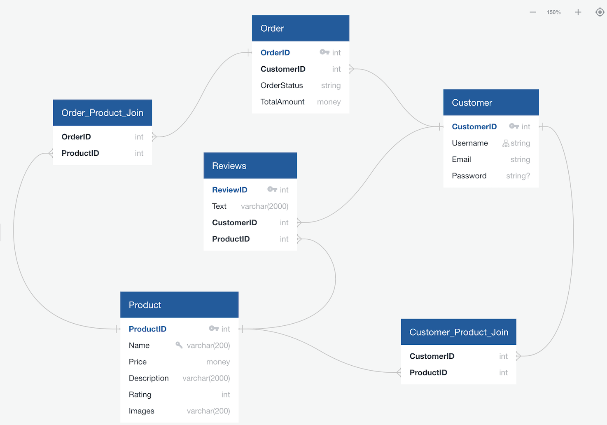
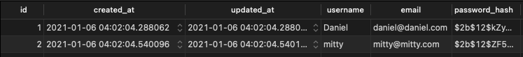
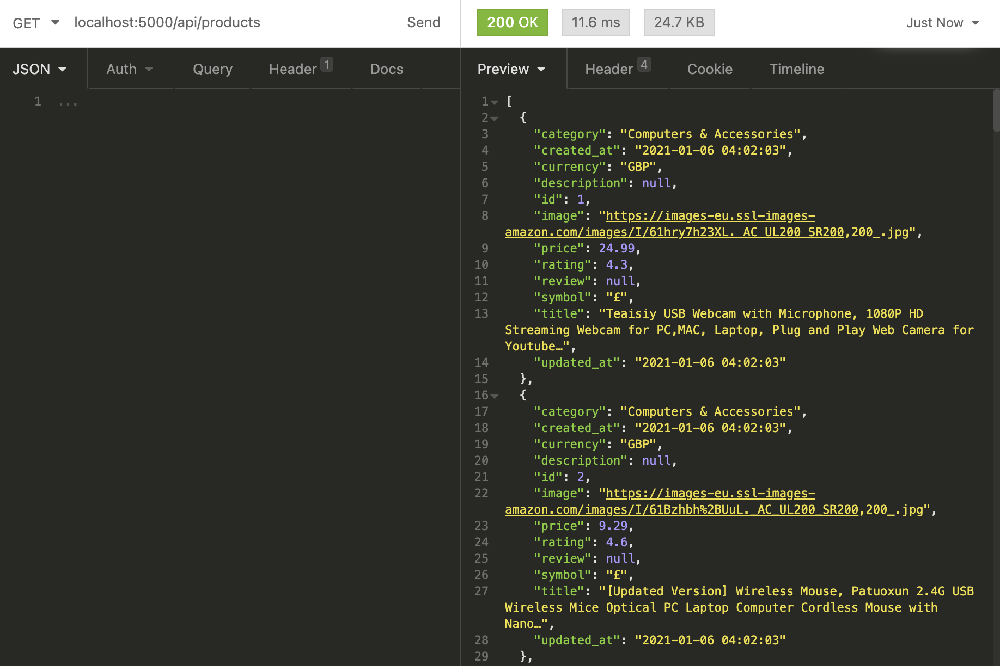
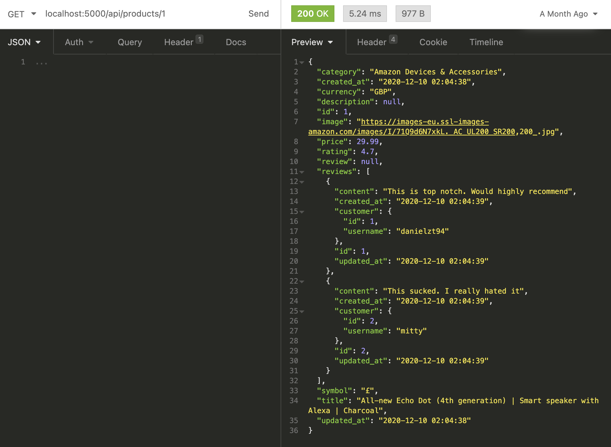
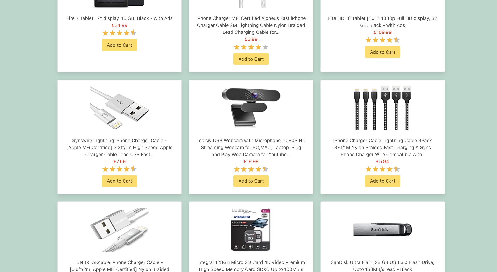
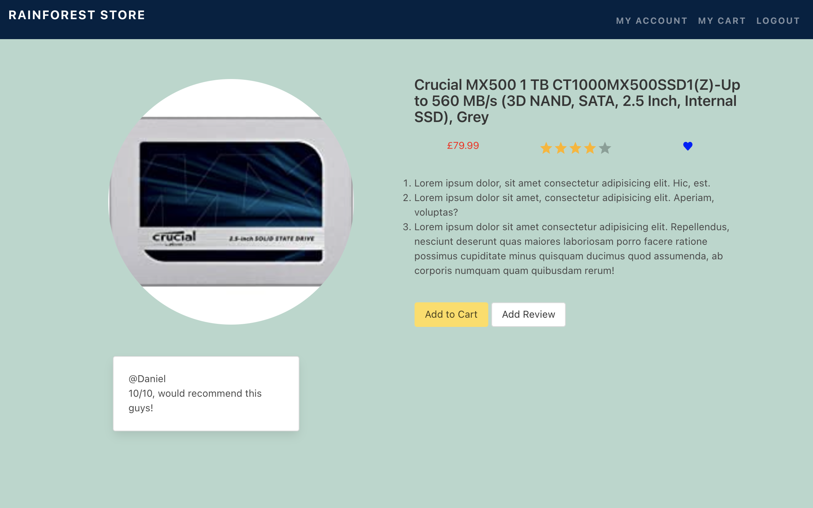
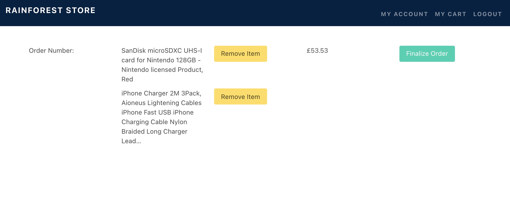
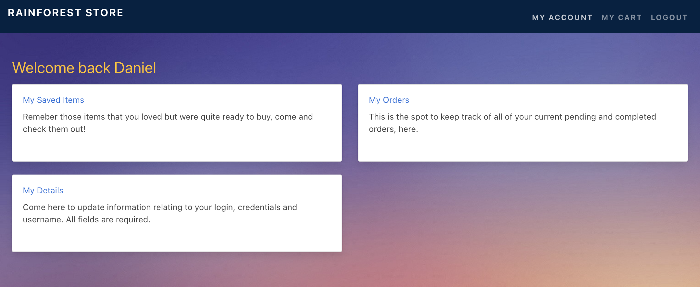

# Rainforest E-Store (SEI Project 4)


## Project Overview

The Rainforest E-Store is a full-stack application where customers can complete their online shopping, through a clean and user friendly interface. It was built using Flask, Python, a postgreSQL relational databse for the back-end,  and a React front-end. 

The concept was inspired by the growing trend of retail businesses improving their online presence during this time. The project presented a considerable increase in complexity in comparison to the projects covered within our classwork.

This was my final and most challenging project with GA, but also my most enjoyble. Despite only having being taught Python and SQL the week prior, I got very comfortable with the languages and creating intricate table relationships.

Upon completion, the project was deployed via Heroku.

### Have a browse at the Rainsforest store [here.](https://rainforeststore.herokuapp.com/)

### Table of Contents

1. [Project Overview](#Project-Overview)
2. [The Brief](#The-Brief)
3. [Technologies Used](#Technologies-Used)
4. [The Approach](#The-Approach)
    - [Planning](#Planning)
    - [The-API](#The-API)
    - [Back-end](#Back-end)
    - [Front-end](#Front-end)
5. [Triumphs](#Triumphs)
6. [Obstacles Faced and Lessons](#Obstacles-Faced-and-Lessons)
7. [Future Features](#Future-Features)

## The Brief

- Build a full-stack MERN web application, making my own front-end and back-end
- Use a Python Flask API using  a Flask Rest Framework to serve my data from a PostgreSQL database
- Be a complete product which means multiple relationships and CRUD functionality for the relevant models
- Implement thoughtful user stories/wireframes, significant enough to clearly determine which features are core MVP and which are stretch goals
- Be deployed online so its accessible publicly (using Heroku)

<br>

## Technologies Used:

### Back-end tech:

- Python
- Flask
- Marshmallow
- SQL Alchemy
- JSON Web Token
- Bcrypt
- PostgreSQL
- TablePlus

### Front-end tech:

- HTML
- CSS
- Bootstrap
- Bulma
- JavaScript
- React (with hooks)
- Axios
- Material UI

### Development Tools:

- VS Code
- Git
- GitHub
- Insomnia

<br>

## The Approach

### Planning:

Once the concept for the application and our choice of API were finalised, the emphasis was placed on ensuring that the model design was robust. The motivation behind this was to avoid major code refactoring and debugging further down the line.

Our key considerations were:
- What SQL tables/models were necessary
- In some scenarios, whether an outright table or a table column would be optimal
- What table relationships to create
- What the MVP and stretch goals for the project were <!-- (via User Stories) -->
- What pages were needed on the frontend, and how they would interact with the API

Our model-centric planning process came at the detriment of other apsects of the app (which will be expanded on througout the document) but overall, set a solid foundation for us to proceed.

Quick DBD was used to create the entity relationship diagrams, graphically describing the relationships between the models:



This is the final design that was settled on, following several iterations.

### The API:

The data seeded into the product model in our backend was fetched from [Rainforest API.](https://rainforestapi.com/) This API was chosen due to its rich catalogue with thousands of product scraped from Amazon. The responses contained datapoints such as price, description etc., necessary for our e-commerce website.

In the seed file, the "get_product" function was created to format the data in a way that was compatible with the product model: 

```py
def get_product(name, url):
    resp = requests.get(f'https://api.rainforestapi.com/request?api_key={API_KEY}&type=bestsellers&url={url}')
    request_dictionary = resp.json()
    products_list = request_dictionary['bestsellers']

    print(f'Updating postgres details for {name}')

    for item in range(len(products_list)):
      try:
        product = ProductModel(
          title = products_list[item]['title'],
          rating = products_list[item]['rating'],
          category = products_list[item]['current_category']['name'],
          price = products_list[item]["price"]["value"],
          currency = products_list[item]['price']['currency'],
          symbol = products_list[item]['price']['symbol'],
          image = products_list[item]['image']
        )
      except: 
        continue

      product.save()
```
The generator below, looped through each of the name and url arguements in the "bestsellers_list". The url was then embedded into the get request, and the list of products were fetched by category. There were a total of 36 categories within the bestsellers list and dozens of prodcuts per cateogry.

```py
  bestsellers_list = [
    ("Amazon Devices & Accessories", "https://www.amazon.co.uk/Best-Sellers/zgbs/amazon-devices/ref=zg_bs_nav_0/261-3310178-9376341"),
    ("Amazon Launchpad", "https://www.amazon.co.uk/Best-Sellers-Amazon-Launchpad/zgbs/boost/ref=zg_bs_nav_0/261-3310178-9376341"),
    ("Apps & Games", "https://www.amazon.co.uk/Best-Sellers-Appstore-Android/zgbs/mobile-apps/ref=zg_bs_nav_0/261-3310178-9376341"),
    ("Audible Audiobooks & Originals", "https://www.amazon.co.uk/Best-Sellers-Audible-Audiobooks/zgbs/audible/ref=zg_bs_nav_0/261-3310178-9376341"),
    ("Computers and Accessories", "https://www.amazon.co.uk/Best-Sellers-Computers-Accessories/zgbs/computers/ref=zg_bs_nav_0/261-3310178-9376341")
  ]

  [get_product(name, url) for name, url in bestsellers_list]
```

There was a constraint on the number of API calls we could make with our membership type, as a result all but one category were commented out for development with the intention of using all categories for deployment.

### Back-end:

#### Models

As referenced in the planning section, the complexity of the relationships between our models meant that a lot of time was dedicated towards their design. This paid dividends when it came to the actual writing of the code as the desired output was achieved.

Models were created for:
- Customers
- Orders
- Products
- Reviews

The build of the relevent tables was relatively simple. This was verified, using TablePlus to ensure the expected columns were produced.

```py
class CustomerModel(db.Model, BaseModel):

  __tablename__ = "customers"

  username = db.Column(db.String(200), nullable=False)
  email = db.Column(db.String(200), nullable=False, unique=True)
  password_hash = db.Column(db.String(200), nullable=False)
```

The models were first created in Flask, before being converted to PostgreSQL using SQLAlechemy.

Each column witin the table  corresponds to a line of code within the "CustomerModel" class. 



The "id", "created_at" and "updated_at" columns, originate from the BaseModel, which was passed in as an arguement to the class, prior to it being extended by the custom fields that were added. These *mixin's* were added to all of the models used throughout the app, simplifying the code.

```py
class BaseModel: 

  id = db.Column(db.Integer, primary_key=True)
  created_at = db.Column(db.DateTime, default=datetime.utcnow)
  updated_at = db.Column(db.DateTime, default=datetime.utcnow)
```

The complexity kicked in when it came to desiging the relationships. We designed the following for the stated reasons;

**Many to Many (M-M)** 
- Order & Products <br> - When a customer checks out (places an order), they are able to buy many items (prodcuts) at a time, whether they be a variety of different products or a bulk buy of the same product. <br> - Provided there is enough stock, products are able to be purchased as part of many different orders. <br>

- Customers & Products <br> - A customer is be able to save more than one item to their favourites/wish-list <br> - Popular items can be added to the wish-lists/favourited by many customers.

**One to Many (1-M)** 
- Products to Reviews - A product in the store can have many customer reviews.
- Customers to Orders - A customer is able to return and place another order.
- Customers to Reviews - Assuming a customer buys more than one product, they are able to leave reviews for each of those prodcuts.

From this basis, the models illustrated in the entity relationship diagram above were built.

The M-M relation relationships the products shared with the order and customer models meant that join a table was required. <br>

Here is an extract of the order-product join:

```py
from app import db

orders_products_join = db.Table('orders_products',
  db.Column('order_id', db.Integer, db.ForeignKey('orders.id'), primary_key=True),
  db.Column('product_id', db.Integer, db.ForeignKey('products.id'), primary_key=True)
```

It's purpose was to create a standalone table that stored a record for each of the combinations between the counterpart tables as a row. (READ NOTES AND ELABORATE ON WHY THIS WAS NECESSARY MORE EXPLICITYLY!!!) A lot of prior code and rationale was required for this to function.

Within the order model, the product model and the order-product join were imported. It was vital that these imports was carried out in only one of the counterparts, and not both (READ NOTES AND EXPLICTY ELABORATE ON WHY!!! - IS IT RECURSION???)


```py
from app import db
from models.base import BaseModel
from models.product import ProductModel
from models.order_product import orders_products_join
from models.customer import CustomerModel

class OrderModel(db.Model, BaseModel):

  __tablename__ = 'orders'

  total_amount = db.Column(db.Float, nullable=True)
  order_status = db.Column(db.String(20), nullable=False)
  current_order = db.Column(db.Boolean, nullable=True)

  customer_id = db.Column(db.Integer, db.ForeignKey('customers.id'), nullable=True)  
  customer = db.relationship('CustomerModel', backref='orders')

  products = db.relationship('ProductModel', secondary=orders_products_join, backref='orders')
```
*The code referencing the relationship can be found within the bottom line of the class.*

I chose the order model as it possessed only one M-M relationship, whereas the product model had two. This choice made our code simpler and easier to read, however it would have worked either way. For this same reason, the imports were carried out in the customer model for the customer-product M-M relationship.

Within the same model, reference to the 1-M relationship between customers and orders can be found. This was enabled by adding a the customer ID number as a foreign key to the table and coding the relaitonship just beneath.

#### Serializers

Given that our Flask back-end was written in Python, as it stood, the models were not able to interact with our API (written in JSON) and React front-end. The serializers facilitated the communication between the disparate languages, acting as a form a translator. This was achieved using Marshmallow.

Each of our models (including the base) had a corresponsing schema to which it was imported.
This was no exception for the "Product Schema" below:

```py
from app import ma
from serializers.base import BaseSchema
from marshmallow import fields
from models.product import ProductModel

class ProductSchema(ma.SQLAlchemyAutoSchema, BaseSchema):

  class Meta:
    model = ProductModel
    load_instance = True
```

An important aspect of Marshamllow was that it permits nested fields to be added to the schema. This feature allowed me to represent the table relationships defined as part of the models in the JSON responses. This was an essential for the upcoming front-end build (e.g. retrieving an order history). 

As I a result, I could decide if, when, and where in the app certain relationships fields would be visible. This was done by duplicaating the necessary schemas and adding nested fields as desired. 

An instance of this was the "Populated Product Schema":

```py
from app import ma
from serializers.base import BaseSchema
from marshmallow import fields
from models.product import ProductModel

class PopulatedProductSchema(ma.SQLAlchemyAutoSchema, BaseSchema):

  class Meta:
    model = ProductModel
    load_instance = True

  reviews = fields.Nested('ReviewSchema', many=True)
```

The nested reviews field was not present in the Product Schema, but makes an appearance here. The added benefit of this will be explaied within the controllers section.


#### Controllers

Flasks Blueprint pattern was used to create the routes for the project, dictating the logic that retireved data from the data and returned JSON objects to the front-end server. These routes are located within three controllers for the app.
- Customer controller
- Order controller
- Product controller

It is within these routes that the schemas were instantiated, and the functioanilty of the backend comes to action.

Taking a look at the product controller:

```py
router = Blueprint(__name__, 'products')

product_schema = ProductSchema()
populated_product = PopulatedProductSchema()
```

Both the product schema and populated product schema were imported to the product controller and available for instantiaition. This gave me a great level of control of the JSON object datapoints that were returned from each route. I could decide which schema to use based on which specific datapoints were necessary for that part of the user journey.

This was demonstrated with the "get_products" and the "get_single_product" functions:

The former function was built with the purpose of fetching the data for all products that would be rendered on a homepage style compoonent.

```py
@router.route('/products', methods=['GET'])
def get_products():
  products = ProductModel.query.all()
  return product_schema.jsonify(products, many=True), 200
```
 Whereas the latter was built with the intent of rendering a single product on its individual page. 



```py
@router.route('/products/<int:id>', methods=['GET'])
def get_single_product(id):
  single_product = ProductModel.query.get(id)

  if not single_product:
    return { 'message': 'This product is not available' }, 404

  return populated_product.jsonify(single_product), 200
```


Given this context, it was deemed unnecessary for the populated prodcuts schema (containing the nested review field) to be instantiated for the route returning all products, but essential for the individual product page.

#### Adding an item to the cart:

Adding items to the cart was the trickiest fucntion to implement across the app due to the complex logic involved.


```py
@router.route('/products/<int:product_id>/add-to-cart', methods=['PUT', 'POST'])
@secure_route
def add_to_cart(product_id):
  single_product = ProductModel.query.get(product_id)
  single_product_data = product_schema.dump(single_product)
  current_order = OrderModel.query.filter_by(customer_id=g.current_user.id, current_order=True).first()
  current_order_data = populated_order_schema.dump(current_order) 
  current_customer = CustomerModel.query.filter_by(id=g.current_user.id).first()
  current_customer_data = customer_schema.dump(current_customer)

  if current_order: 
    try:
      item = populated_order_schema.load(
      {"products": [*current_order_data['products'], single_product_data]},
      instance=current_order,
      partial=True
    )
      item.save()

    except ValidationError as e:
      return { 'errors': e.messages, 'message': 'Something went wrong.' }  

    current_order = OrderModel.query.filter_by(customer_id=g.current_user.id, current_order=True).first()
    current_order_data = order_schema.dump(current_order)

    try:
      calculate_amount = current_order_data['total_amount']
      
      for i in range(len(current_order_data['products'])):
        calculate_amount = current_order_data['products'][i]['price'] + calculate_amount
      
      total_amount = populated_order_schema.load(
        {"total_amount": calculate_amount},
        instance=current_order,
        partial=True
      )

      total_amount.save()
    
    except ValidationError as e:
      return { 'errors': e.messages, 'message': 'Something went wrong.' }
  
    return populated_order_schema.jsonify(item), 200


  elif not current_order: 
    create_new_item = populated_order_schema.load({
      "current_order": "true",
      "products": [single_product_data],
      "customer_id": g.current_user.id,
      "order_status": "In progress",
      "total_amount": single_product_data['price']},
      instance=OrderModel()
    )

    try:
      create_new_item.save()

    except ValidationError as e:
      return { 'errors': e.messages, 'message': 'Something went wrong.' }

    return populated_order_schema.jsonify(create_new_item), 200
  
  else:
    return 'No data recorded', 200
    
```

There "current_order" field within the order model has a data type of Boolean. When True, this denotes that this is the order currently being executed and points to the corresponding order ID. This line is essential in adding items to the correct order when adding to cart.


```py
class OrderModel(db.Model, BaseModel):
  __tablename__ = 'orders'

  # total_amount = db.Column(db.Float, nullable=True)
  # order_status = db.Column(db.String(20), nullable=False)
  # customer_id = db.Column(db.Integer, db.ForeignKey('customers.id'), nullable=True)
  current_order = db.Column(db.Boolean, nullable=True)
  # customer = db.relationship('CustomerModel', backref='orders')
  # products = db.relationship('ProductModel', secondary=orders_products_join, backref='orders')
  ```

  Logic to calculate the sum of prices of all products within the order was present so customers are able to track their total spend.


### Front-end:

The interface and flow of the app was designed to mimic the functionality of a site like Amazon. We decided to include:
- A home page, displaying the catalogue of products
- An individual product page
- My Account page
- My Cart
- Registration and login

#### Home Page



The goods sold on our website were rendered on our page by mapping the products seeded from our database into cards on a page, like below:

```js
{filterProductsResults().map((product, index) => {
            return <div key={index} className="column is-one-third-desktop is-half-tablet is-half-mobile">
              <div className="card">
                <Link to={`/products/${product.id}`} className="card-image">
                  <figure className="image is-4by3">
                    
                  </figure>
                </Link>
                <div className="card-content">
                  <div className="media">
                    <div className="media-content has-text-centered">
                      <p>{product.title}</p>
                      <p className="price">{product.symbol}{product.price}</p>
                      <p><Rating
                        name="hover-feedback"
                        value={product.rating}
                        precision={0.5}
                      /></p>
                      <button value={product.id}
                        onClick={event => addToCart(event.target.value)}
                        className="button is-warning">Add to Cart
                       </button>
                    </div>
                  </div>
                </div>
              </div>
            </div>
          })}
```

Clicking on any of these products leads to the page for the individual product, where the ability to favourite the item and leave reviews is possible.



#### My Cart

Once items are added to the cart, they land here.



Customers are able to keep track of the items they had added and keep a running total of the cost.

CRUD funcitonality was implemented into the page with the options to remove items and finalize the order granted. Upon finalising an order, a put request made updateting the current users order history.

```js
  function handleFinalize() {
    axios.put(`/api/orders/finalize-order`, {}, {
      headers: { Authorization: `Bearer ${token}` }
    })
      .then(resp => {
        props.history.push('/')
      })
  }

  if (!cart[0]) {
    return <h1>No open cart</h1>
  }
```

#### My Account Page



The My Account page acted as the hub for users to view their order history, their favourites and update their credentials. Each have their own individual pages that can be accessed by clicking on the links.

<br>

## Triumphs

- Learned and gained confidence with a new programming language (Python and SQL) in a condensed time-frame
- Achieved all stretch goals involving the backend.
- Error free experience using git, ie losing data or mismanaged conflicts.
- Gained a stronger sense of my strengths and weaknesses as an Engineer, and my preference towards using Python back-end devlopment(I still do enjoy front-end)


<br>

## Obstacles Faced and Lessons

- We exhausted our API call limit twice, meaning a new email address had to be set up to continue with work (for free). This was due largely to us seeding too many products from the API during development. In future we will seed the bare minimum to limit our calls and add the full prodcut list at the end.
- We were unable to have as many prodcuts as desired on the site due to the detrimental effect it has on the speed and performance of the server. In the furture, I will design with pagination in mind to avoid fetching all prodcuts/data at once.
- Too little time left towards the end of the project to work on and build a more visually impressive front-end. In future, wireframing will be conducted at an earlier stage (ours was done after the back-end build)
- Poor internet connectivity made communication difficult at critical moments during the proejct. I qucikly learned to adapt and communicate technical/debugging issues via written communication effectively in slack - when Zoom was not available

<br>

## Future Features

- Overall polishing of the design of the app across all components
- Introduction of a chatbot using websockets to answer user queries
- Creating a specific add_to_favourites function within the customer controller for better fucntionality